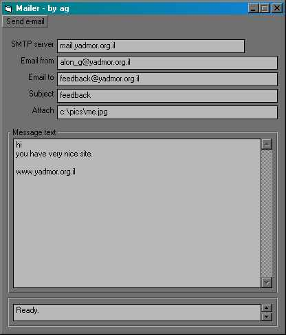



## myEmail \- send your email with attachment

### Description

myEmail is a small email sender that can send attachment.

the program using the winsock control and tcp/ip.

the attachment will be incoded in the base64 alogarithm wich i made myself.

fell free to wite me email to alon_g@yadmor.org.il and tell me what you think of this code.

i hope it will be useful for you as a developer.

if you think this code is nice you can vote for it in the contest. i will be very thankful.

enjoy.

alon gal
 
### More Info
 
in the MAIL TO: type just youre email.

in the FROM MAIL: type just the receiver email.

             |
---                |---
**Submitted On**   |2000-04-23 15:31:36
**By**             |[Alon Gal](https://github.com/Planet-Source-Code/PSCIndex/blob/master/ByAuthor/alon-gal.md)
**Level**          |Intermediate
**User Rating**    |4.8 (81 globes from 17 users)
**Compatibility**  |VB 5\.0, VB 6\.0
**Category**       |[Internet/ HTML](https://github.com/Planet-Source-Code/PSCIndex/blob/master/ByCategory/internet-html__1-34.md)
**World**          |[Visual Basic](https://github.com/Planet-Source-Code/PSCIndex/blob/master/ByWorld/visual-basic.md)
**Archive File**   |[CODE\_UPLOAD51184232000\.zip](https://github.com/Planet-Source-Code/alon-gal-myemail-send-your-email-with-attachment__1-7519/archive/master.zip)

